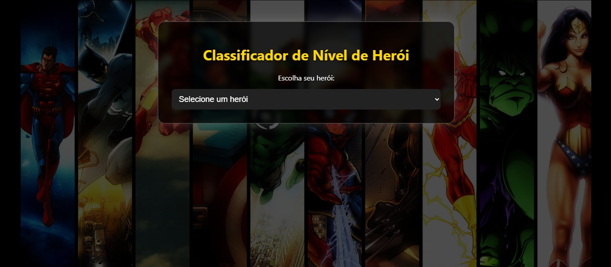
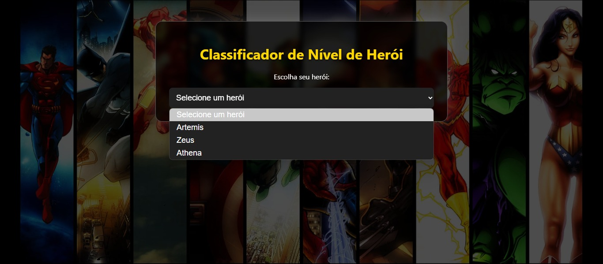
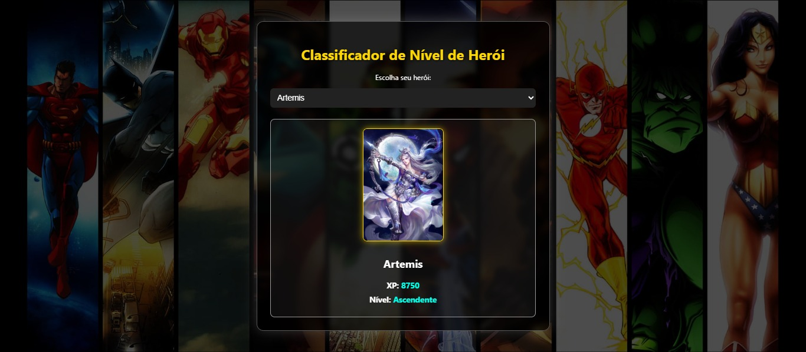
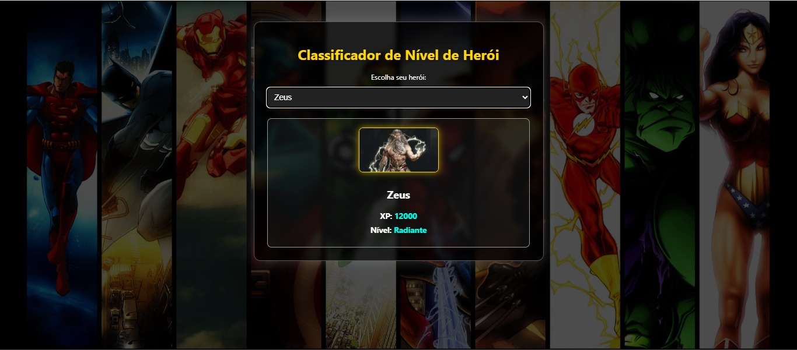
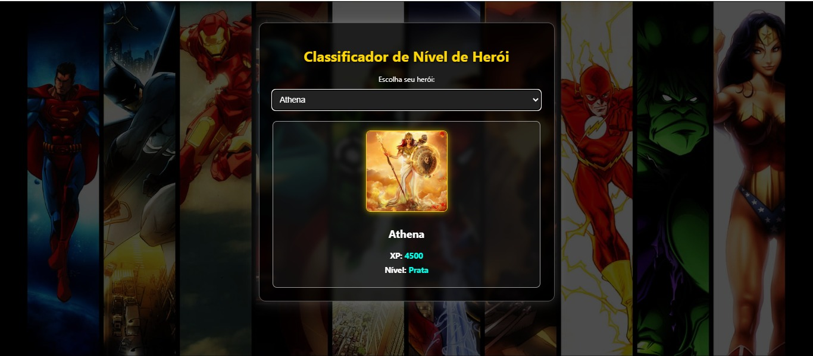

# 🦸‍♂️ Classificador de Nível de Herói 🛡️

Este projeto foi desenvolvido como parte de um desafio prático da **DIO (Digital Innovation One)**. Ele classifica o nível de um herói com base em sua experiência (XP), utilizando estruturas básicas de programação e um layout visual estilo "HQ".

---

## 🚀 Tecnologias Utilizadas

- HTML5
- CSS3 (com estilo heroico 🔥)
- JavaScript
- Imagens personalizadas de heróis

---

## 🎯 Objetivo

O objetivo do projeto é praticar:

- ✅ Declaração de variáveis  
- ✅ Uso de estruturas condicionais  
- ✅ Manipulação do DOM  
- ✅ Estilização com CSS  
- ✅ Interação entre elementos HTML e JS

---

## 📌 Como Funciona

1. O usuário seleciona um herói no menu suspenso.
2. A imagem e a XP do herói são exibidas.
3. O sistema calcula e exibe o nível do herói com base na XP.

### 🏅 Faixas de Classificação:

| XP (Experiência)        | Nível        |
|-------------------------|--------------|
| 0 - 1.000               | 🪨 Ferro      |
| 1.001 - 2.000           | 🥉 Bronze     |
| 2.001 - 5.000           | 🥈 Prata      |
| 5.001 - 7.000           | 🥇 Ouro       |
| 7.001 - 8.000           | 💠 Platina    |
| 8.001 - 9.000           | 🛡️ Ascendente |
| 9.001 - 10.000          | 🧿 Imortal    |
| 10.001+                 | 🌟 Radiante   |

---

## 🖼️ Imagens e Estilo

- O fundo do site é composto por uma imagem de heróis (ex: Vingadores, Liga da Justiça etc.) com efeito de escurecimento para melhor leitura.
- As cartas dos heróis têm destaque visual com bordas douradas e efeitos de sombra.
- O tema foi feito para simular a interface de um jogo ou história em quadrinhos.

---

## 📸 Demonstrações do Projeto

### 🎮 Interface Principal


---

### 🦸‍♂️ Herói Selecionado com Nível


---

### 🌌 Heróis selecionado


---

### 🌌 Heróis selecionado


---

### 🌌 Heróis selecionado


---

## 🛠️ Como Rodar Localmente

1. Clone este repositório:
   ```bash
   git clone https://github.com/seu-usuario/nome-do-repositorio.git
